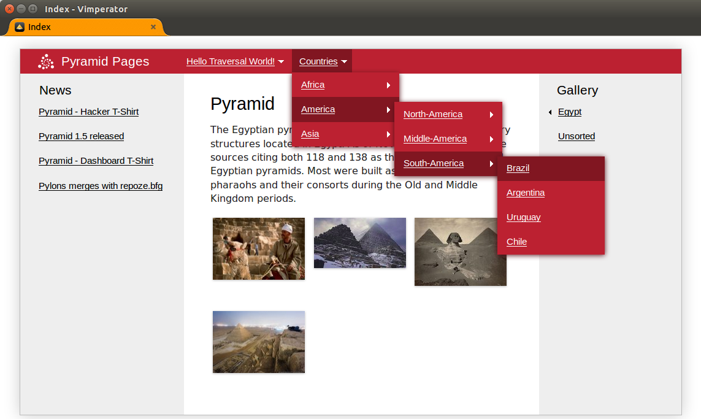

.. pyramid_pages documentation master file, created by
   sphinx-quickstart on Tue Oct  7 16:14:25 2014.
   You can adapt this file completely to your liking, but it should at least
   contain the root `toctree` directive.

pyramid_pages
=============

**pyramid_pages** provides a collections of pages to your Pyramid application.
This is very similar to **django.contrib.flatpages** but with a tree structure
and traversal algorithm in URL dispath.

.. toctree::
   :maxdepth: 4

   install
   configuration
   api

Tutorials and Cookbook Recipes
==============================

.. toctree::
   :maxdepth: 4

   tutorial

Support and Development
=======================

To report bugs, use the `issue tracker
<https://github.com/uralbash/pyramid_pages/issues>`_.

We welcome any contribution: suggestions, ideas, commits with new futures, bug
fixes, refactoring, docs, tests, translations etc

If you have question, contact me sacrud@uralbash.ru or IRC channel #sacrud

Indices and tables
==================

* :ref:`genindex`
* :ref:`modindex`
* :ref:`search`

