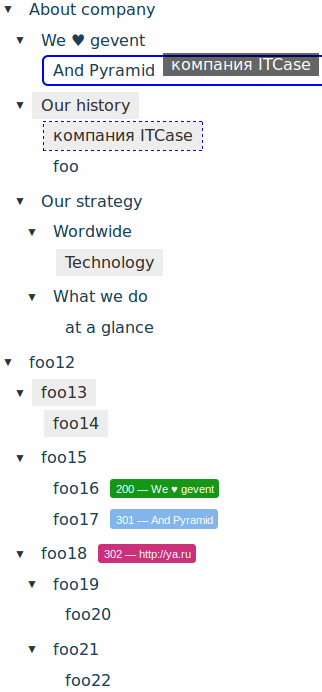

.. ps_pages documentation master file, created by
   sphinx-quickstart on Tue Oct  7 16:14:25 2014.
   You can adapt this file completely to your liking, but it should at least
   contain the root `toctree` directive.

ps_pages
========

**ps_pages** provides a collections of pages to your Pyramid application.
This is very similar to **django.contrib.flatpages** but with a tree structure
and traversal algorithm in URL dispath.

Online example can be found here `pyramid_sacrud_example <http://pyramid-sacrud-example.readthedocs.org/en/latest/demo.html#online-on-runnable-com>`_

.. toctree::
   :maxdepth: 4

   install
   configuration
   api

Tutorials and Cookbook Recipes
==============================

.. toctree::
   :maxdepth: 4

   tutorial

.. include:: contribute.rst

Indices and tables
==================

* :ref:`genindex`
* :ref:`modindex`
* :ref:`search`

