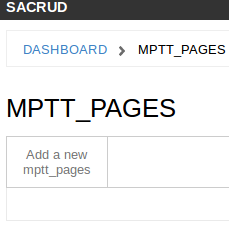
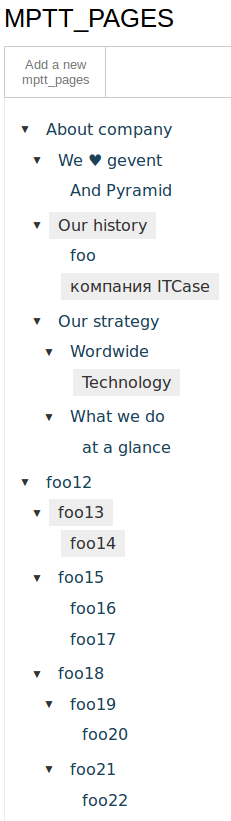

.. _simple_tutorial:

Simple Web-site with tree pages
===============================

This is an example of using `ps_pages` in just one file (app.py).
Full code you can see `there <https://github.com/ITCase/ps_pages/blob/master/example/>`_.

Pyramid application
-------------------

Create Pyramid application

.. code-block:: python
    :linenos:

    from wsgiref.simple_server import make_server

    from pyramid.config import Configurator
    from pyramid.response import Response

    def hello_world(request):
        return Response('<a href="/admin/">Admin</a> ' +
                        ' <a href="about-company">About company page</a>')

    def get_app():
        config = Configurator()

        config.add_route('hello', '/')
        config.add_view(hello_world, route_name='hello')

        return config.make_wsgi_app()

    if __name__ == '__main__':
        app = get_app()
        server = make_server('0.0.0.0', 8080, app)
        server.serve_forever()

Create model for tree pages
---------------------------

All pages are stored in the database.
Create a table of pages inherited from :py:class:`ps_pages.models.BasePages`

.. code-block:: python
    :linenos:
    :emphasize-lines: 6-34

    from wsgiref.simple_server import make_server

    from pyramid.config import Configurator
    from pyramid.response import Response

    from sqlalchemy.ext.declarative import declarative_base
    from sqlalchemy import Column, Integer

    from sacrud.common import TableProperty
    from ps_pages.models import BasePages

    Base = declarative_base()

    class MPTTPages(BasePages, Base):
        __tablename__ = "mptt_pages"

        id = Column('id', Integer, primary_key=True)

        @TableProperty
        def sacrud_list_col(cls):
            col = cls.columns
            return [col.name, col.level, col.tree_id,
                    col.parent_id, col.left, col.right]

        @TableProperty
        def sacrud_detail_col(cls):
            col = cls.columns
            return [('', [col.name, col.slug, col.description, col.visible]),
                    ('Redirection', [col.redirect_url, col.redirect_page,
                                    col.redirect_type]),
                    ('SEO', [col.seo_title, col.seo_keywords, col.seo_description,
                            col.seo_metatags])
                    ]

    def hello_world(request):
        return Response('<a href="/admin/">Admin</a> ' +
                        ' <a href="about-company">About company page</a>')

    def get_app():
        config = Configurator()

        config.add_route('hello', '/')
        config.add_view(hello_world, route_name='hello')

        return config.make_wsgi_app()

    if __name__ == '__main__':
        app = get_app()
        server = make_server('0.0.0.0', 8080, app)
        server.serve_forever()

Configure project
-----------------

Now in our application to add settings for `sqlalchemy`, `pyramid_sacrud`
and `ps_pages`.

.. code-block:: python
    :linenos:
    :emphasize-lines: 1-5, 10,11, 16-18, 20-24, 26-29

    from sqlalchemy import engine_from_config
    from sqlalchemy.orm import scoped_session, sessionmaker
    from zope.sqlalchemy import ZopeTransactionExtension

    DBSession = scoped_session(sessionmaker(extension=ZopeTransactionExtension()))

    def get_app():
        config = Configurator()
        settings = config.registry.settings
        settings['sqlalchemy.url'] = "sqlite:///example.sqlite"

        config.add_route('hello', '/')
        config.add_view(hello_world, route_name='hello')

        # Database
        engine = engine_from_config(settings)
        DBSession.configure(bind=engine)

        # SACRUD
        settings['pyramid_sacrud.models'] = (('Pages', [MPTTPages]), )
        config.include('pyramid_sacrud', route_prefix='/admin')

        # sacrud_pages - put it after all routes
        settings['ps_pages.model_locations'] = 'app:MPTTPages'
        config.include("ps_pages")

        return config.make_wsgi_app()

Now at this URL http://localhost:8080/admin/ you can see model of pages.

.. image:: _static/img/tutorial/admin.png

Initialize pages model
----------------------

Create a table in the database

.. no-code-block:: python
    :linenos:
    :emphasize-lines: 11-16

    import transaction

    ...

    def get_app():
        ...
        # Database
        engine = engine_from_config(settings)
        DBSession.configure(bind=engine)

        # initialize
        try:
            MPTTPages.__table__.create(engine)
            transaction.commit()
        except Exception as e:
            print e

        ...

And see empty model http://localhost:8080/admin/mptt_pages

Add fixtures
------------

Let's create a function table filling

.. code-block:: python
    :linenos:

    def add_fixture(model, fixtures, session):
        """
        Add fixtures to database.

        Example::

        hashes = ({'foo': {'foo': 'bar', '1': '2'}}, {'foo': {'test': 'data'}})
        add_fixture(TestHSTORE, hashes)
        """
        for fixture in fixtures:
            session.add(model(**fixture))

    def add_mptt_tree(session):
        session.query(MPTTPages).delete()
        transaction.commit()
        tree1 = (
            {'id': '1', 'slug': 'about-company', 'name': 'About company', 'visible': True, 'parent_id': None},
            {'id': '2', 'slug': 'we-love-gevent', 'name': u'We ♥ gevent', 'visible': True, 'parent_id': '1'},
            {'id': '3', 'slug': 'and-pyramid', 'name': 'And Pyramid', 'visible': True, 'parent_id': '2'},
            {'id': '4', 'slug': 'our-history', 'name': 'Our history', 'visible': False, 'parent_id': '1'},
            {'id': '5', 'slug': 'foo', 'name': 'foo', 'visible': True, 'parent_id': '4'},
            {'id': '6', 'slug': 'kompania-itcase', 'name': u'компания ITCase', 'visible': False, 'parent_id': '4'},
            {'id': '7', 'slug': 'our-strategy', 'name': 'Our strategy', 'visible': True, 'parent_id': '1'},
            {'id': '8', 'slug': 'wordwide', 'name': 'Wordwide', 'visible': True, 'parent_id': '7'},
            {'id': '9', 'slug': 'technology', 'name': 'Technology', 'visible': False, 'parent_id': '8'},
            {'id': '10', 'slug': 'what-we-do', 'name': 'What we do', 'visible': True, 'parent_id': '7'},
            {'id': '11', 'slug': 'at-a-glance', 'name': 'at a glance', 'visible': True, 'parent_id': '10'},
        )

        tree2 = (
            {'id': '12', 'slug': 'foo12', 'name': 'foo12', 'visible': True, 'parent_id': None, 'tree_id': '2'},
            {'id': '13', 'slug': 'foo13', 'name': 'foo13', 'visible': False, 'parent_id': '12', 'tree_id': '2'},
            {'id': '14', 'slug': 'foo14', 'name': 'foo14', 'visible': False, 'parent_id': '13', 'tree_id': '2'},
            {'id': '15', 'slug': 'foo15', 'name': 'foo15', 'visible': True, 'parent_id': '12', 'tree_id': '2'},
            {'id': '16', 'slug': 'foo16', 'name': 'foo16', 'visible': True, 'parent_id': '15', 'tree_id': '2'},
            {'id': '17', 'slug': 'foo17', 'name': 'foo17', 'visible': True, 'parent_id': '15', 'tree_id': '2'},
            {'id': '18', 'slug': 'foo18', 'name': 'foo18', 'visible': True, 'parent_id': '12', 'tree_id': '2'},
            {'id': '19', 'slug': 'foo19', 'name': 'foo19', 'visible': True, 'parent_id': '18', 'tree_id': '2'},
            {'id': '20', 'slug': 'foo20', 'name': 'foo20', 'visible': True, 'parent_id': '19', 'tree_id': '2'},
            {'id': '21', 'slug': 'foo21', 'name': 'foo21', 'visible': True, 'parent_id': '18', 'tree_id': '2'},
            {'id': '22', 'slug': 'foo22', 'name': 'foo22', 'visible': True, 'parent_id': '21', 'tree_id': '2'},
        )
        add_fixture(MPTTPages, tree1, session)
        add_fixture(MPTTPages, tree2, session)

And just run it when initialize project

.. no-code-block:: python
    :linenos:
    :emphasize-lines: 12

    ...

    def get_app():
        ...
        # Database
        engine = engine_from_config(settings)
        DBSession.configure(bind=engine)

        # initialize
        try:
            MPTTPages.__table__.create(engine)
            add_mptt_tree(DBSession)
            transaction.commit()
        except Exception as e:
            print e

        ...

Delete old database file `example.sqlite` and run project again.
Now project has a new structure of pages.

Run and Fun :)
--------------

Run `python app.py` and goto http://localhost:8080/

You now have available page by traversal URL, like:

* http://localhost:8080/about-company/
* http://localhost:8080/about-company/we-love-gevent/
* http://localhost:8080/about-company/we-love-gevent/and-pyramid/
